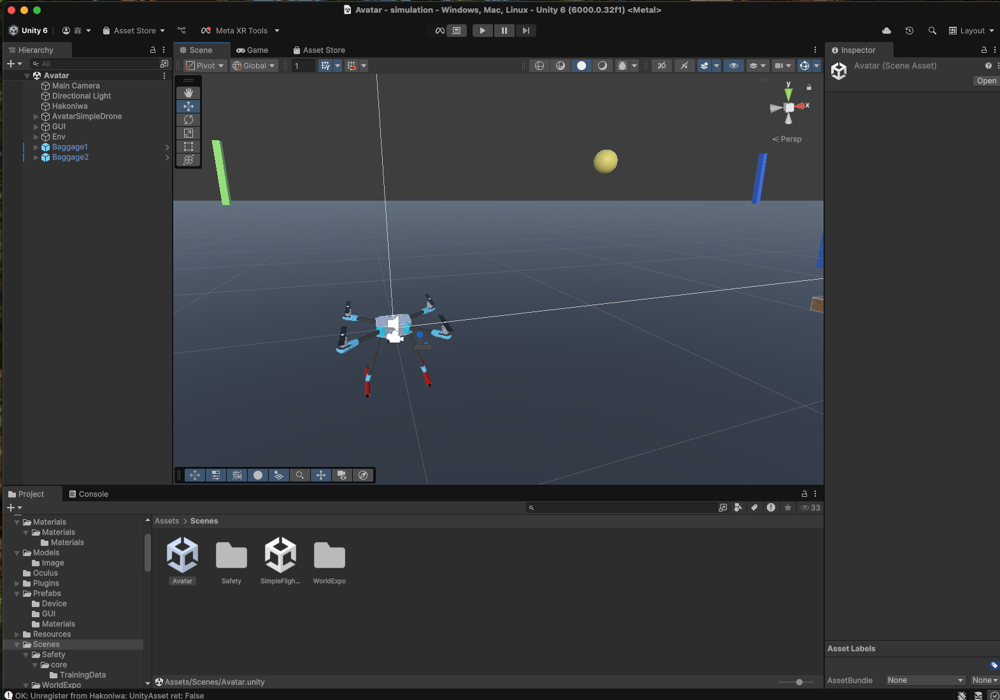
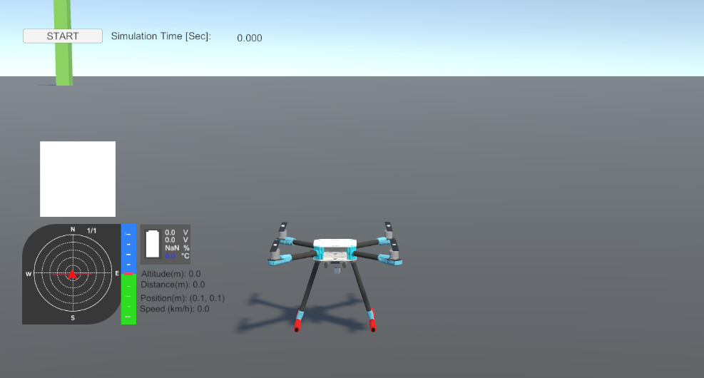

このリポジトリでは、[hakoniwa-px4sim](https://github.com/toppers/hakoniwa-px4sim) を発展させ、拡張性と汎用性を高めたドローンシミュレータのコア機能を提供します。PX4やArdupilot、ロボットシステム(ROS)、さらにはスマホ、XR、Webとの連携も視野に入れた柔軟な設計が特徴です。

# 🚨 License Notice / ライセンスについて
This project is distributed under a custom non-commercial license.
本プロジェクトはカスタム非商用ライセンスの下で配布されています。

- 📄 License (English): [LICENSE](LICENSE)
- 📄 ライセンス (日本語): [LICENSE.ja](LICENSE.ja)

⚠️ Commercial use is prohibited | 商用利用は禁止されています
For commercial licensing inquiries:
商用ライセンスに関するお問い合わせ: tmori@hakoniwa-lab.net

# コンセプト

「シミュレーションの世界を飛び出す！」をモットーに、以下の3つを柱としています：

- **シンプルさ**: 誰でも簡単に使えるドローンシミュレータ。  
- **多様性**: ゲーム、教育、研究、ビジネスなど、幅広いアプリケーションに対応。  
- **接続性**: PX4/Ardupilot、Unity、ROS、スマホ、XR、Webとのシームレスな連携。

---

## 「シミュレーションの世界を飛び出す！」とは？

仮想空間の中に閉じず、**現実世界の課題解決や価値創造**を目指したシステム設計を意味します：

### **1. 現実世界との接続**
- **PX4/Ardupilot** や **ROS** と連携し、実機さながらの制御を実現。  
- **物流試験や展示用途**での活用に対応。  
- 仮想シミュレーションの結果を、すぐに実機テストや運用に反映可能。  

### **2. 多様なプラットフォーム対応**
- **スマホ、XR、Web、Unity** など、さまざまなデバイスや環境で動作。  
- ゲームやエンターテインメントコンテンツとしても展開可能。  

### **3. ユーザーの創造性を拡大**
- 教育向けに、学生や学習者が簡単にモデリングや制御工学を体験できるツールを提供。  
- 非専門家でも気軽に利用できる設計で、ゲームや展示会での体験提供にも最適。

---


# ユースケース

- ゲーム: ドローン操縦を手軽に楽しむ。
- エンタメ: 展示用途（例: 万博でのデモ）。
- 訓練: プロ操縦者向けのリアルな動作再現。
- 教育: 制御工学やモデリング学習。
- 研究: 環境や機体のシミュレーション。
- 物流: 実証実験場として活用。


# 特徴

1. C/C++ ベース： 箱庭ドローン・コア機能をCライブラリとして提供し、他の言語での拡張を容易化。
2. [TOPPERS ライセンス](https://www.toppers.jp/license.html)：オープンソースで、商用利用も可能。
3. 複数プラットフォーム対応: Windows, Mac, Linux, WSL2 など主要OSをサポート。
4. 箱庭モードと非箱庭モードのサポート
   - 箱庭あり：ロボットシステム(ROS)や、スマホやXR、Webと連携したシミュレーションが可能。
   - 箱庭なし：ドローンの物理モデルや制御モデルを独立して実行することが可能。PX4/Ardupilotとの連携も可能。

# 依存ライブラリ

## 外部

- [glm](https://github.com/g-truc/glm.git) : 数学ライブラリ。
- [mavlink_c_library_v2](https://github.com/mavlink/c_library_v2.git) : MAVLink通信ライブラリ。
- [nlohmann/json](https://github.com/nlohmann/json.git) : JSON操作ライブラリ。

## 内部

- [hakoniwa-core-cpp-client](https://github.com/toppers/hakoniwa-core-cpp-client.git) : 箱庭シミュレーションとの統合。
- [hakoniwa-ros2pdu](https://github.com/toppers/hakoniwa-ros2pdu.git) : 箱庭PDUとの統合。

# アーキテクチャ


- comm (通信モジュール) : TCP/UDP の通信インタフェース
  - ICommServer API: サーバーサイドの通信機能を提供
    - TCP/UDPプロトコルに対応した通信サーバーの生成
    - エンドポイントでの接続待ち受けと通信管理
    - 使用前には必ずcomm_init()の呼び出しが必要
  - ICommClient API: クライアントサイドの通信機能を提供
    - TCP/UDPプロトコルに対応した通信クライアントの生成
    - 送信元・送信先エンドポイントの指定による通信確立
    - 使用前には必ずcomm_init()の呼び出しが必要
  - ICommIO API: 通信データの送受信機能を提供
    - データの送信・受信操作の抽象化インターフェース
    - TCPでは到達保証とリトライ機能を提供
    - UDPでは高速な通信を実現（到達保証なし）
  - 詳細な API 仕様は[サーバー](docs/api/comm/server/api_comm_server.md)、[クライアント](docs/api/comm/client/api_comm_client.md)、[IO](docs/api/comm/io/api_comm_io.md)を参照
- mavlink (MAVLINK通信) : MAVLINK通信のインタフェース
- physics (物理モデル) :  [機体の物理モデル](docs/api/physics/README-ja.md)
- controller (制御モデル) : 機体の制御モデル
- aircraft (機体モデル) : 物理モデルおよびセンサ/アクチュエータを統合した機体モデル
- service (サービス)
  - aircaft_service (機体サービス) : 箱庭なしで、PX4と連携するためのサービス
  - drone_service (ドローンサービス) : 箱庭なしで、制御/物理モデルを実行するためのサービス
- hakoniwa (箱庭) :  serviceを箱庭に統合したサービス
- logger (ログ) :  機体のログ
- config (コンフィグ) :  ドローンのコンフィグ

# 動作環境

* サポートOS
  * Arm系Mac
  * Windows 11
  * Windows WSL2
  * Ubuntu 22.0.4

* ビルド・テストツール
  * cmake
  * googletest

* 必要なツール類
  * pyenv
    * python: version 3.12.0
      * 3.13以降では動きません。
      * MacOSの場合、homebrewでインストールしたものでは動きません。

# ✅ シミュレータ準備チェックリスト

このシミュレータは、以下のように **箱庭あり／なし** の2モードで利用可能です。  
それぞれに必要な環境やツールが異なるため、事前に以下のチェックリストをご確認ください。

| 項目 | 説明 | 箱庭あり版 | 箱庭なし版 |
|------|------|------------|------------|
| OS環境 | Windows / macOS (Arm対応) / Linux / WSL2 | ✅ | ✅ |
| Python環境 | `Python 3.12.0` を使用 | ✅ | ✅ |
| Unityエディタ | [hakoniwa-unity-drone](https://github.com/hakoniwalab/hakoniwa-unity-drone) の実行に必要 | ✅ | ❌ |
| Unityプロジェクト準備 | `Avatar` シーンを開き、`START`ボタンでシミュ開始 | ✅ | ❌ |
| hakoniwa-core-cpp-client | 箱庭コアとの接続に必須 | ✅ | ❌ |
| QGroundControl | PX4連携時の操作に使用 | ✅ | ✅ |
| MissionPlanner | Ardupilot連携時の操作に使用 | ✅ | ✅ |
| Gameコントローラ | ラジコン操作に使用 (任意) | ✅ | ❌ |
| Drone用Python API | フライトプラン記述に使用可能 | ✅ | ❌ |
| Web連携 (任意) | [hakoniwa-webserver](https://github.com/toppers/hakoniwa-webserver) など | ✅ | ❌ |
| ROS2連携 (任意) | [hakoniwa-ros2pdu](https://github.com/toppers/hakoniwa-ros2pdu) など | ✅ | ❌ |

📌 **備考**
- Pythonは **3.12.0** 固定（それ以外は非対応）
- Mac環境では `homebrew` 経由のPythonでは動作しません
- Unityエディタは、Unity6.0以降が必要です
- Gameコントローラを使う場合は `rc/rc_config/` の設定ファイルを確認してください

---


# 箱庭なしで利用するケース

箱庭なしで利用する場合、箱庭ドローンの物理モデルと制御モデルを独立して実行することが可能です。

補足：箱庭との連携がありませんので、Unityでのビジュアライズはできません。

提供バイナリとしては以下のものがあります。

1. PX4 連携サンプルアプリ(<os名>-aircraft_service_px4)
2. Ardupilot 連携サンプルアプリ(<os名>-aircraft_service_ardupilot)
3. 箱庭ドローンのCUIサンプルアプリ(<os名>-drone_servce_rc)
4. 箱庭ドローンPro Cライブラリ(hako_service_c)

全てクロスプラットフォーム対応しています。リリースページにあるバイナリをダウンロードしてください。

os名は、以下の通りです。

- mac
- win
- linux

## PX4 連携サンプルアプリの利用方法

PX4 連携サンプルアプリを使うと箱庭ドローンシミュレータの物理モデルとPX4を連携することが可能です。

実行方法：
```bash
<os名>-aircraft_service_px4 <IPアドレス> 4560 ./config/drone/px4 
```

この際、PX4を起動することで、PX4と連携することが可能です。

参考：https://github.com/toppers/hakoniwa-px4sim?tab=readme-ov-file#terminal-a

あわせて、QGCと連携することで、遠隔操作が可能です。


## Ardupilot 連携サンプルアプリの利用方法

Ardupilot 連携サンプルアプリを使うと箱庭ドローンシミュレータの物理モデルとArdupilotを連携することが可能です。

実行方法：
```bash
<os名>-aircraft_service_ardupilot <ホストPCのIPアドレス> 9002 9003 ./config/drone/ardupilot 
```

この際、Ardupilotを起動することで、Ardupilotと連携することが可能です。

```bash
./Tools/autotest/sim_vehicle.py -v ArduCopter -f airsim-copter -A "--sim-port-in 9003 --sim-port-out 9002"  --sim-address=<ホストPCのIPアドレス>  --out=udp:<Mission PlannerのIPアドレス>:14550
```

参考：https://github.com/ArduPilot/ardupilot

この際、Mission Plannerと連携することで、遠隔操作が可能です。

## 箱庭ドローンのCUIサンプルアプリの利用方法

箱庭ドローンシミュレータの物理モデルと制御モデルを連携させて、CUIで操作することが可能です。

```bash
service/drone_service_rc 1 config/drone/rc
```

```
 ----- USAGE -----
 ----- STICK -----
|  LEFT  | RIGHT  |
|   w    |   i    |
| a   d  | j   l  |
|   s    |   k    |
 ---- BUTTON ----
 x : radio control button
 p : get position
 r : get attitude
 t : get simtime usec
 f : flip
 b : get battery status
```


実行例：起動直後のログ
```bash
BatteryModelCsvFilePath: ./tmp_battery_model.csv
BatteryModelCsvFilePath does not exist.
Angle rate control is disabled
Angle rate control is disabled
flip_target_time_sec: 0.4
flip_constant_time_sec: 0.1
target_angular_rate_rad_sec: 25.1327
target_angular_rate_delta: 0.167552
target_angular_inc_time_sec: 0.15
target_angular_dec_time_sec: 0.25
INFO: mixer is enabled
timestep_usec: 1000
DroneService::startService: 1000
> Start service
```

この状態で、アームするには、`x`を入力しエンターキーを押下します。

その後、`w`を入力しエンターキーを押下することで、上昇します。

実行例：アームして上昇
```bash
> Start service
x
w
position x=0.0 y=-0.0 z=0.1
position x=0.0 y=-0.0 z=0.2
position x=0.0 y=-0.0 z=0.3
position x=0.0 y=-0.0 z=0.4
position x=0.0 y=-0.0 z=0.5
position x=0.0 y=-0.0 z=0.6
position x=0.0 y=-0.0 z=0.7
position x=0.0 y=-0.0 z=0.8
position x=0.0 y=-0.0 z=0.9
position x=0.0 y=-0.0 z=1.0
position x=0.0 y=-0.0 z=1.1
```

実行例：前進
```bash
i
position x=0.1 y=0.0 z=1.2
position x=0.2 y=0.0 z=1.3
position x=0.3 y=0.0 z=1.3
position x=0.4 y=0.0 z=1.3
position x=0.5 y=0.0 z=1.3
position x=0.6 y=0.0 z=1.3
```

## 箱庭ドローンPro Cライブラリの利用方法

箱庭ドローンシミュレータは、Cライブラリ(hako_service_c)としてバイナリ公開しています。

以下のヘッダファイルをインクルードすることで、ビルド＆リンク可能です。

- include/service/service.h

なお、C APIヘッダは以下です。

- include/service/drone/drone_service_rc_api.h

# 箱庭ありで利用するケース

箱庭ありで利用する場合、箱庭なしの機能に加えて、以下が可能になります。

1. Unity連携: [hakoniwa-unity-drone](https://github.com/hakoniwalab/hakoniwa-unity-drone)を利用
2. デジタルツイン連携: [Zenoh/ROS2箱庭ブリッジ](https://github.com/toppers/hakoniwa-bridge)を利用
3. Mission Planner連携: [MAVLink箱庭ブリッジ](mavlink/bridge/README.md)を利用
4. 箱庭ドローンのAR共有シミュレーション: [箱庭Webサーバー](https://github.com/toppers/hakoniwa-webserver)および[箱庭ARブリッジ](https://github.com/toppers/hakoniwa-ar-bridge)を利用

箱庭あり版の提供バイナリとしては以下のものがあります。

1. PX4 連携のサンプルアプリ(<os名>-main_hako_aircraft_service_px4)
2. Ardupilot 連携のサンプルアプリ(<os名>-main_hako_aircraft_service_ardupilot)
3. 箱庭ドローンのサンプルアプリ(<os名>-main_hako_drone_servce)

全てクロスプラットフォーム対応しています。リリースページにあるバイナリをダウンロードしてください。

os名は、以下の通りです。

- mac
- win
- linux

## 箱庭コア機能のインストール

箱庭あり版を利用する場合は、事前に、[hakoniwa-core-cpp-client](https://github.com/toppers/hakoniwa-core-cpp-client)をインストールしてください。

Windowsの場合は、WSL2で、以下のコマンドを実行してください。

```bash
dd if=/dev/zero of=/mnt/z/mmap/mmap-0x100.bin bs=1M count=5
```

理由：ramdisk上の mmap ファイルのサイズが足りないため。(5MB以上必要)

## Unityエディタの準備

箱庭あり版を利用する場合は、事前に、[hakoniwa-unity-drone](https://github.com/hakoniwalab/hakoniwa-unity-drone)のsimulatinプロジェクトをUnityエディタで開く必要があります。

Unityエディタ起動後、Avatarシーンを開いてください。



このシーンでは、箱庭ドローンの位置と姿勢情報およびローターのPWMデューティ値を受信し、ドローンの動きをビジュアライズします。

箱庭あり版のサンプルアプリと連携することで、Unityエディタ上で箱庭ドローンの動きを確認できます。

また、シミュレーションを開始するには、下図にある START ボタンを押下してください。



## PX4 連携サンプルアプリの利用方法

PX4 連携サンプルアプリを使うと箱庭ドローンシミュレータの物理モデルとPX4を連携することが可能です。

実行方法：
```bash
<os名>-main_hako_aircraft_service_px4 <IPアドレス> 4560 ./config/drone/px4 <path/to/hakoniwa-unity-drone>/simulation/avatar-drone.json
```

* 補足：
  * Windowsの場合、IPアドレスは、Power Shellで、ipconfigを実行したときのWSLのIPアドレスを指定してください。
  * イーサネット アダプター vEthernet (WSL (Hyper-V firewall)):


この際、PX4を起動することで、PX4と連携することが可能です。

参考：https://github.com/toppers/hakoniwa-px4sim?tab=readme-ov-file#terminal-a

あわせて、QGCと連携することで、遠隔操作が可能です。


シミュレーション実行手順：

1. UnityエディタでAvatarシーンを開く。
2. PX4 連携サンプルアプリを起動する。
3. PX4 を起動する。
4. Unityエディタで、STARTボタンを押下する。
5. QGCを起動し、PX4と接続し、遠隔操作を行う。


## Ardupilot 連携サンプルアプリの利用方法

Ardupilot 連携サンプルアプリを使うと箱庭ドローンシミュレータの物理モデルとArdupilotを連携することが可能です。

実行方法：
```bash
<os名>-main_hako_aircraft_service_ardupilot <ホストPCのIPアドレス> 9002 9003 ./config/drone/ardupilot <path/to/hakoniwa-unity-drone>/simulation/avatar-drone.json
```

この際、Ardupilotを起動することで、Ardupilotと連携することが可能です。

```bash
./Tools/autotest/sim_vehicle.py -v ArduCopter -f airsim-copter -A "--sim-port-in 9003 --sim-port-out 9002"  --sim-address=<ホストPCのIPアドレス>  --out=udp:<Mission PlannerのIPアドレス>:14550
```

参考：https://github.com/ArduPilot/ardupilot

この際、Mission Plannerと連携することで、遠隔操作が可能です。

シミュレーション実行手順：

1. UnityエディタでAvatarシーンを開く。
2. Ardupilot 連携サンプルアプリを起動する。
3. Ardupilot を起動する。
4. Unityエディタで、STARTボタンを押下する。
5. Mission Planner を起動し、Ardupilot と接続し、遠隔操作を行う。


## 箱庭ドローンのサンプルアプリの利用方法

箱庭ドローンのサンプルアプリを使うと、箱庭ドローンシミュレータの物理モデルと制御モデルを連携させて、CUIで操作することが可能です。

箱庭ドローンのサンプルアプリは、以下の２種類あります。

1. ラジコン操作のサンプルアプリ
2. フライトプラン操作のサンプルアプリ

### ラジコン操作のサンプルアプリ

お使いのゲームコントローラで箱庭ドローンを操作することが可能です。

実行方法：
```bash
<os名>-main_hako_drone_servce  ./config/drone/rc <path/to/hakoniwa-unity-drone>/simulation/avatar-drone.json
```

この際、ラジコン操作用のPythonスクリプトを利用することで、箱庭ドローンを操作できます。

```bash
python rc/rc-custom.py <path/to/hakoniwa-unity-drone>/simulation/avatar-drone.json rc/rc_config/ps4-control.json
```

最後の引数(ps4-control.json)は、お使いのゲームコントローラに合わせて変更してください。

シミュレーション実行手順：

1. UnityエディタでAvatarシーンを開く。
2. 箱庭ドローンのサンプルアプリを起動する。
3. Unityエディタで、STARTボタンを押下する。
4. ラジコン操作用のPythonスクリプトを起動する。
5. ゲームコントローラで、箱庭ドローンを操作する。


### フライトプラン操作のサンプルアプリ

箱庭ドローンの [Python API](drone_api/libs/README.md) を利用して、フライトプランを実行することが可能です。

フライトプラン操作のサンプルアプリ：[sample.py](drone_api/rc/sample.py)

実行方法：
```bash
<os名>-main_hako_drone_servce  ./config/drone/api <path/to/hakoniwa-unity-drone>/simulation/avatar-drone.json
```

この際、フライトプラン操作用のPythonスクリプトを利用することで、箱庭ドローンを操作できます。

```bash
python rc/sample.py <path/to/hakoniwa-unity-drone>/simulation/avatar-drone.json
```

シミュレーション実行手順：

1. UnityエディタでAvatarシーンを開く。
2. 箱庭ドローンのサンプルアプリを起動する。
3. Unityエディタで、STARTボタンを押下する。
4. フライトプラン操作用のPythonスクリプトを起動する。

# TIPS

- [Windows で 箱庭あり版PX4/Ardupilot連携する場合について](docs/tips/wsl/hakoniwa-wsl.md)
- [WSL で、Ardupilot を起動すると Warning, time moved backwards. Restarting timer.が出た時の対処方法](docs/tips/wsl/warning-timer.md)
- [Ardupilot SITL のセットアップ方法](docs/tips/wsl/ardupilot-setup.md)
- [WSL/docker 環境のセットアップ方法](docs/tips/wsl/docker-setup.md)
- [WSL/docker 環境で箱庭&PX4連携方法](docs/tips/wsl/docker-px4.md)
- [WSL/docker 環境で箱庭&Ardupilot連携方法](docs/tips/wsl/docker-ardupilot.md)

