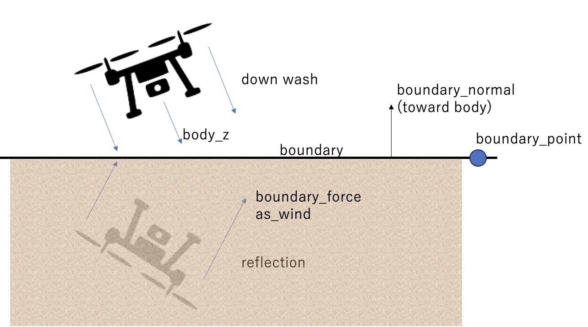

# 境界外乱API

## 概要

このAPIは、ドローンが以下のような境界に接近したときに受ける外乱力の影響を計算します。

- 地面
- 天井
- 壁

これらの3つの境界は平面としてモデル化され、同じアルゴリズムで処理されます。
この外乱は、ローターのダウンウォッシュが境界表面で反射することによって発生し、特に低高度での運用（離陸や着陸）中にドローンの飛行力学に影響を与える可能性があります。

ドローンが地面近くをホバリングしたり飛行したりすると、地面の近接性により揚力と推力が増加します。この効果により、ローターによって生成される有効推力が増加し、自由空間で必要とされるよりも低い力でドローンがホバリングできるようになります。

また、ドローンが天井に接近すると、同様の効果を経験し、ドローンが天井に引き寄せられるように感じます。

これらの現象の力は、「地面効果」として知られており、ローターによって生成された風が近くの表面で反射すると仮定して計算されます。このAPIは、この力を直接計算する関数、またはそれを等価な風速としてモデル化する関数を提供します。すべての引数は地上座標系を使用し、必要に応じて（`body_vector_from_ground`によって）機体座標系に変換します。

この力が有効な領域は、境界に非常に近い場所のみです。

## 関数
- `boundary_disturbance`: 境界への近接によって生じる外乱力ベクトルを計算します。
- `boundary_disturbance_as_wind`: 計算された外乱力を等価な風速ベクトルに変換し、物理モデルに風の影響として統合できます。

## 使用方法

以下は、`boundary_disturbance` 関数を使用して地面効果による力を計算する例です。

```cpp
// ドローンと境界の状態を定義します
VectorType drone_position = {1.0, 2.0, 0.5}; // 地上座標系でのドローンの位置
EulerType drone_euler = {0.1, -0.1, 0.5};   // ドローンの姿勢
double current_thrust = 15.0;              // 現在の推力
double rotor_radius = 0.1;                 // ドローンのローター半径

// 境界を定義します（例：地面）
VectorType boundary_point = {0.0, 0.0, 0.0};   // 地面平面上の点
VectorType boundary_normal = {0.0, 0.0, -1.0};  // 地面の法線ベクトル（地面からドローンに向かう方向）

// 外乱力を計算します
ForceType disturbance_force = boundary_disturbance(
    drone_position,
    drone_euler,
    boundary_point,
    boundary_normal,
    current_thrust,
    rotor_radius
);

// この disturbance_force は、物理シミュレーションでドローンに作用する合計力に追加できます。または、

// 等価な風の外乱に変換することもできます。
VectorType wind_dist_e = boundary_disturbance_as_wind(
    drone_position, drone_euler, boundary_point, boundary_normal, current_thrust, rotor_radius, {0.1, 0.1, 0.1}
);

// 風の影響を機体座標系に変換します
VectorType w_d = body_vector_from_ground(wind_dist_e, drone_euler);

// 最終的に、風の影響をドローンの加速度に適用します
AccelerationType acceleration = acceleration_in_body_frame(..., (w + w_d), ...);
```

## 引数

### `boundary_disturbance`
```cpp
ForceType boundary_disturbance(
    const VectorType& position,       /* 地上座標系でのドローンの位置 */
    const EulerType& euler,           /* ドローンのオイラー角 */
    const VectorType& boundary_point, /* 最も近い境界上の点（地上座標系） */
    const VectorType& boundary_normal,/* 最も近い境界の法線ベクトル（表面からドローンに向かう方向） */
    double thrust,                    /* ドローンの推力（常に >= 0） */
    double rotor_radius,              /* 風の外乱に対するローター半径の影響 */
    double exponent = 1.5             /* 外乱比の指数（通常は1.5） */
);
```

## 物理モデル



計算は、ローターのダウンウォッシュが近くの境界から反射するのをシミュレートするモデルに基づいています。これにより、ドローンに作用する追加の力が発生します。モデルは次のように実装されています。

1.  **境界までの距離の計算**: ドローンから境界平面までの垂直距離 ($d$) が計算されます。この効果は、ドローンが境界に十分に接近している場合にのみ機能します。

$$
    d = |(p_{drone} - p_{boundary}) \cdot n|
$$

ここで、 $p_{drone}$ はドローンの位置、 $p_{boundary}$ は境界上の点、 $n$ は境界の法線ベクトルです。

2.  **推力ベクトルの変換**: ドローンの推力ベクトル（機体z軸に沿っている）は、地上座標系(e)に変換されます。

$$
    T_e = R(\phi, \theta, \psi)
    \left[ \begin{array}{c}
        0 \\
        0 \\
        T
    \end{array} \right]
$$

ここで、 $R$ は機体座標系から地上座標系への回転行列、 $T$ は推力の大きさです。

3.  **反射力の計算**: 推力ベクトルは境界平面で反射され、風が表面で跳ね返るのをシミュレートします。

$$
    T_{ref} = T_e - 2 (T_e \cdot n) n
$$

地面、天井、壁、のどのタイプでも、この式で求まります。

4.  **外乱比の計算**: 外乱力の強さは、境界からの距離が増加するにつれて減少します。これは、距離 $d$ とローター半径 $R$ に依存するスケーリング比( $ratio$ )によってモデル化されます。

$$
    ratio = \frac{1}{(1 + d/R)^{k}}
$$

ここで、 $k$ は指数で、通常は `1.5` に設定されます（ $1 \le k \le 2$ ）。

5.  **最終的な外乱力**: 最終的な外乱力は、計算された比率でスケーリングされた反射力です。

$$
    T_{dist} = ratio \times T_{ref}
$$

## 風の外乱バージョン

`boundary_disturbance_as_wind` 関数は、境界効果をモデル化する別の方法を提供します。直接力を加える代わりに、ドローンに同様の抗力効果をもたらす等価な風速を計算します。

これは、計算された外乱力を抗力係数（具体的には、1次抗力係数のz成分 `drag1.z` が近似の代理として使用されます）で割ることによって実現されます。 $W$ は風速[m/s]。$C_{drag}$ は速度に対する抗力係数。

$$
    W = T_{dist}/C_{drag}
$$

これにより、地面効果を、すでに風の外乱を考慮している物理モデルにシームレスに統合できます。

この効果は、境界からの距離とともに急速に減少し、ドローンが境界に十分に接近している場合にのみ適用されます。


## 参考文献
- アルゴリズム概要： https://github.com/hakoniwalab/hakoniwa-drone-pro/issues/54
- 地面降下とボルテックスリング：https://www.tead.co.jp/blog/%E3%83%9C%E3%83%AB%E3%83%86%E3%83%83%E3%82%AF%E3%82%B9%E3%83%BB%E3%83%AA%E3%83%B3%E3%82%B0%E3%83%BB%E3%82%B9%E3%83%86%E3%83%BC%E3%83%88%E3%81%A8%E3%81%AF%EF%BC%9F%E9%A3%9B%E8%A1%8C%E6%99%82%E3%81%AE/
- 着陸時に知っておきたい：https://www.fujitaka.com/fdps/column/column53.html